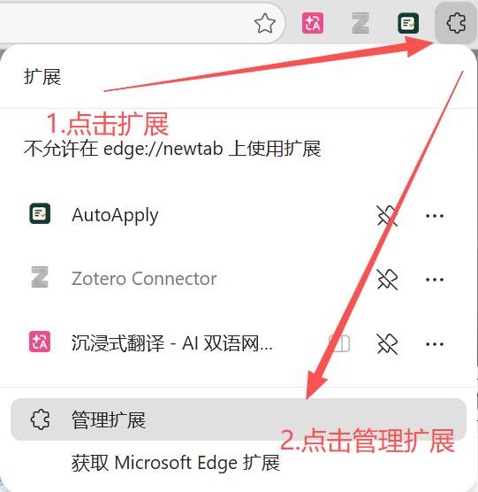
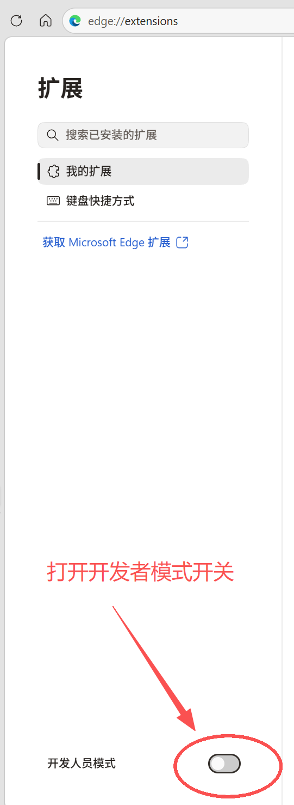
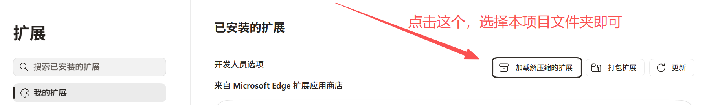

# Microsoft Edge 安装与使用指南

这份指南适用于 Windows 上的 Microsoft Edge。AutoApply 是开发者模式下加载的未打包扩展，不需要安装 npm 或其他运行时依赖。

## 1. 打开扩展管理

点击 Edge 右上角的“扩展”按钮，再点击“管理扩展”。

也可以直接在地址栏打开：

edge://extensions

## 2. 开启开发者模式

在扩展管理页打开右侧的“开发人员模式”开关。

## 3. 加载 AutoApply

点击“加载解压缩的扩展”，选择 AutoApply 项目文件夹。

加载成功后，把 AutoApply 固定到工具栏，之后可以在招聘网站页面快速打开。

## 4. 第一次使用

1. 点击 AutoApply 图标，进入“设置”。
2. 在“用 AI 导入简历”区域点击“复制提示词”。
3. 打开你信任的 AI 服务，例如豆包、通义、ChatGPT 或其他模型。
4. 把提示词和你的简历一起发送给模型。
5. 要求模型只返回 AutoApplyResumeImportV1 JSON。
6. 把返回的 JSON 粘贴回 AutoApply 的第二个文本框。
7. 点击“解析并预览”，检查字段和值。
8. 点击“应用到资料编辑器”，再检查一次。
9. 点击底部“保存资料”。

使用 AI 导入时，简历内容会由你主动复制到所选 AI 服务。AutoApply 不会自动上传简历，也不会读取 AI 对话内容。

## 5. 填写招聘表单

1. 打开招聘网站的申请表页面。
2. 点击 AutoApply 图标。
3. 点击“开始填写”。
4. 检查绿色已填写字段和橙色待处理字段。
5. 手动确认日期、选项、证件、声明等敏感字段。
6. AutoApply 不会自动点击最终提交按钮。

## 更新扩展

下载新版本后，回到 edge://extensions，在 AutoApply 卡片上点击刷新按钮。不要先卸载扩展，否则可能影响浏览器本地保存的资料。

后续可以在 docs/guides/ 下增加 Chrome、Brave 等浏览器的安装指南。
